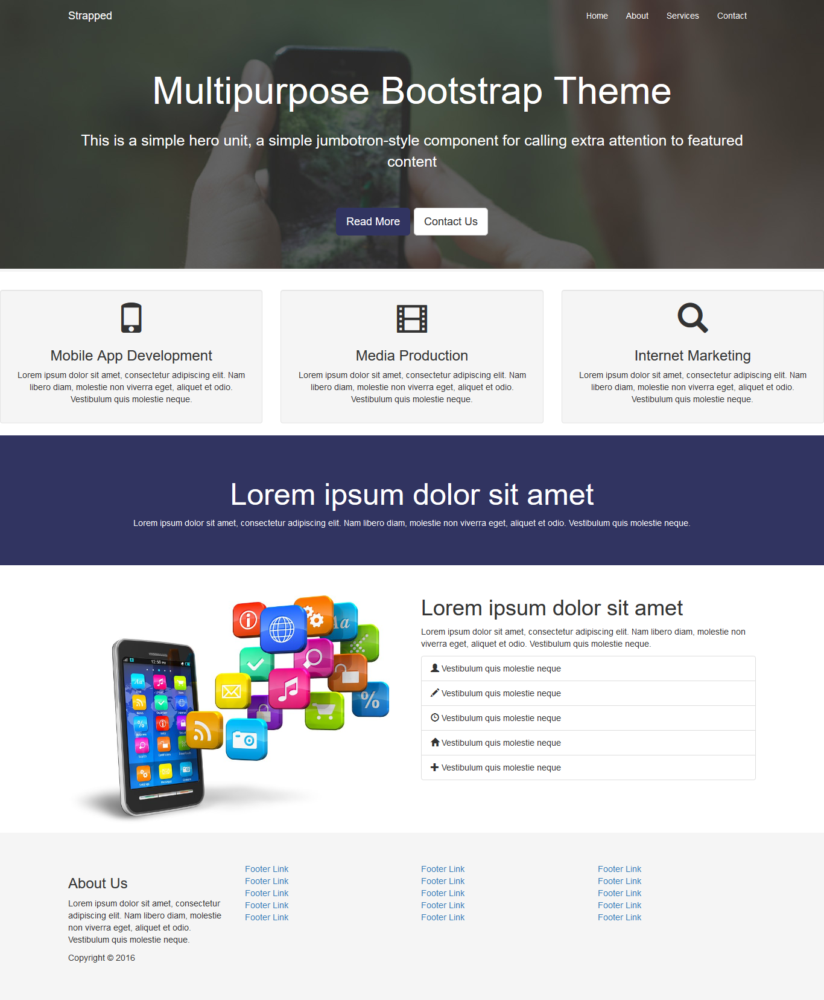
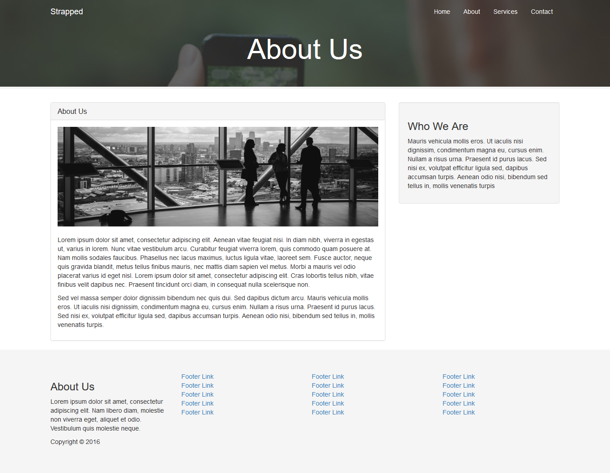
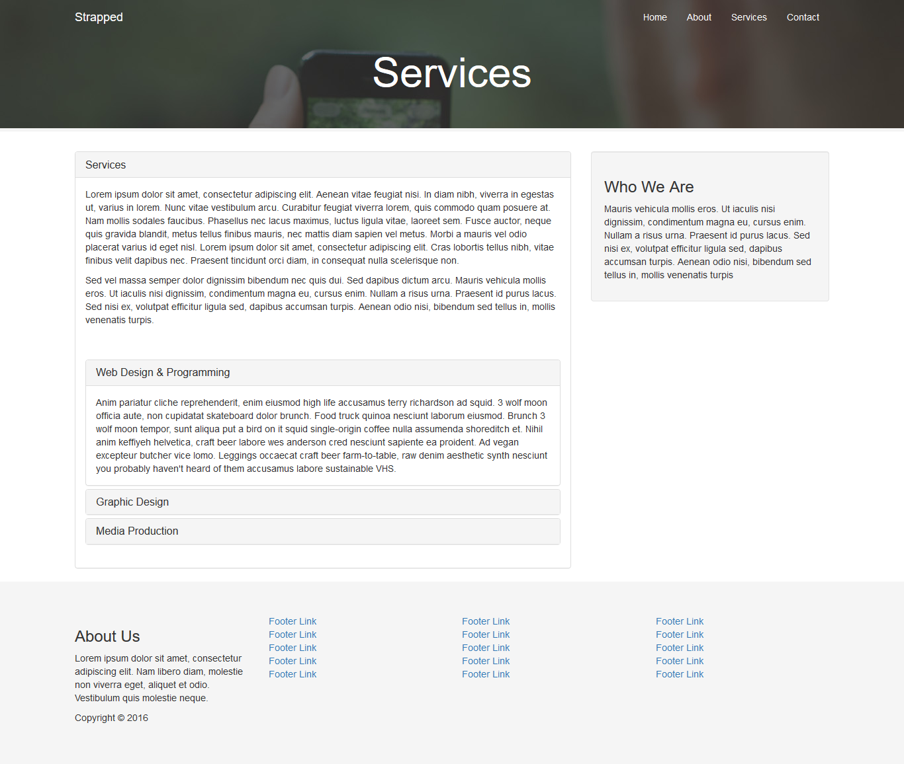
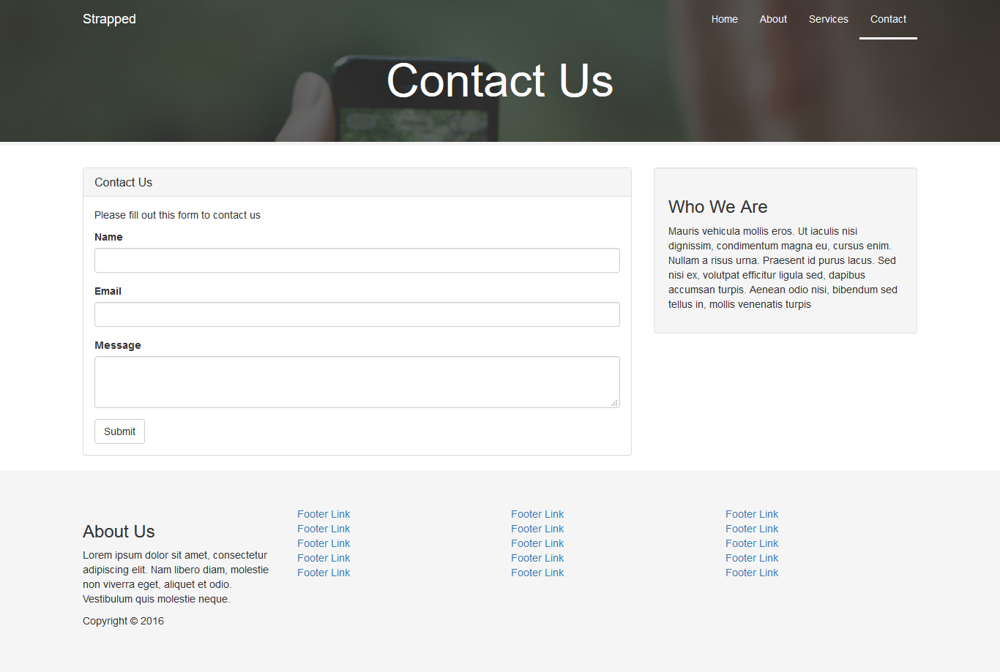

# Multiple-Bootstrap-Theme Template

Multiple-Bootstrap-Theme Template using HTML5, CSS3, Bootstrap4.

## Getting Started

These instructions will get you a copy of the project up and running on your local machine for development . See deployment for notes on how to deploy the project on a live system.

### Prerequisites

What things you need to install the software and how to install them

```
Text Editor of your choise and your prefered browser.
```

### How to use

A step by step series of examples that tell you how to use this template

Say what the step will be

```
Download the zip or copy the repo.
```

Unzip the zip file if downloaded.

```
Use the template in your browser.
```


## Deployment

You can deploy this template to any of your frontend project

## Built With

* [Bootstrap4](https://getbootstrap.com/docs/4.3/getting-started/introduction/) - The Bootstrap 4 framework used
* [HTML5](https://www.tutorialspoint.com/html5/) - HTML 5
* [CSS3](https://www.tutorialspoint.com/css/css3_tutorial.htm) - CSS3

## Project Screenshot
#### Home Page

#### About us Page

#### Services Page

#### Contact Page



## Authors

* **Shubham Gupta** - *Entire Template work* - [Itshubham](https://github.com/itshubham)


## License

This project is licensed under the MIT License - see the [LICENSE.md](LICENSE) file for details


